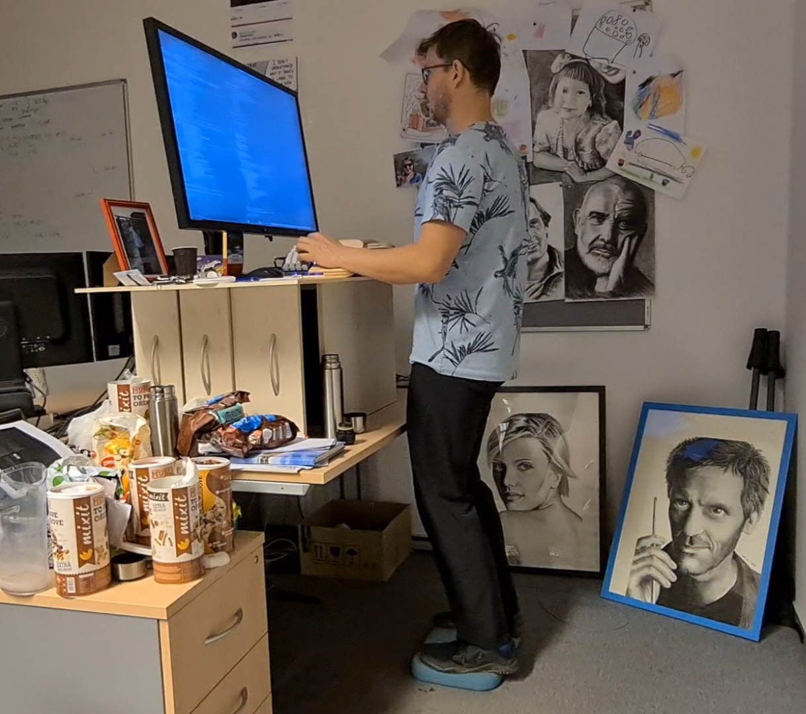

* Healthy programmer

I have always wanted to have a crystal-clear desk and work in a transparent, well-organized environment. :)

[[./hardening/20220118_114153.jpg]]

Michal Kelemen

The motivation for this project is to share my long-term experience with setting up a working environment
that helps keep people who sit for long periods fresh and healthy, both mentally and physically.
Topics I would like to present include:

- Ergonomic keyboard and wrist support to keep your arms and shoulders in a neutral position without upper or lower back bending
- Daily exercise routine for a flexible body as compensation for long periods of sitting during the day
- Cold water hardening in the middle of the workday to recharge your energy
- Useful working environment patterns for better comfort

I am 45 years old now (2026-03-27), and I have spent about 6 years working intensively behind the computer, in addition to my early childhood experience with computers.
During the difficult Covid-19 year (2020/2021), when everyone else was working from home, I was commuting daily to the
open space office, and my employer (Gratex International) allowed me to set up a new, effective working environment.

One year later, I would like to share this journey with you.

* Ergonomic keyboard

- [[file:./keyboard/keyboard.org][Construction]]
- [[file:./keyboard/traditional-vs-ergo.org][Natural body position while sitting]]
- [[file:./exercise/standing.org][Standing while working as an alternative]]

* Healthy stuff

- [[./exercise/exercise.org][Daily exercise routine]]
- [[./hardening/hardening.org][Hardening in the cold water]]

* Useful working environment patterns

- [[file:./extreme-programming/pair-programming.org][Pair programming]]
- [[file:./patterns/4k-code-visualization.org][4K monitor for better code visualization]]
- [[file:./workspace/workspace.org][Multi-workspace environment using a tile-based window manager that allows you to navigate through applications subconsciously]]
- Subconscious navigation via keyboard shortcuts (TODO: Document your vim/emacs frequently used shortcuts, lisp-like wrap, slurp, barf, raise code manipulation)
- [[file:./patterns/keep.org][Keep playing/learning - effective ways to deal with frustration]]

Michal
