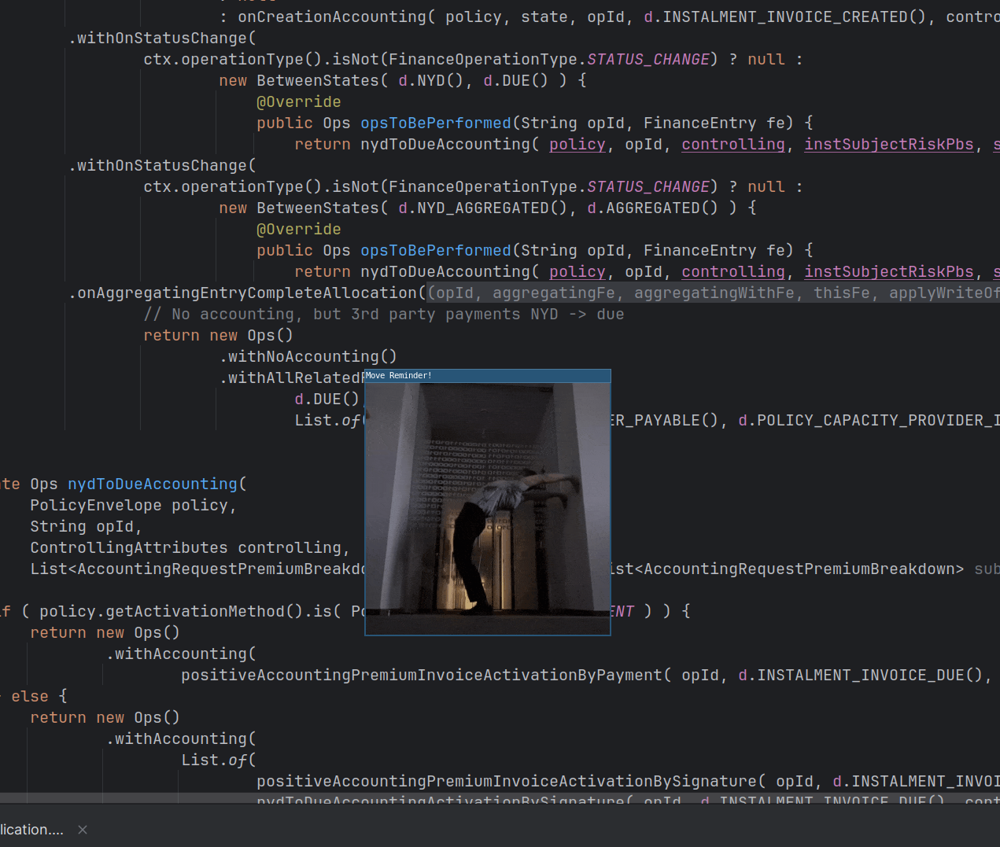
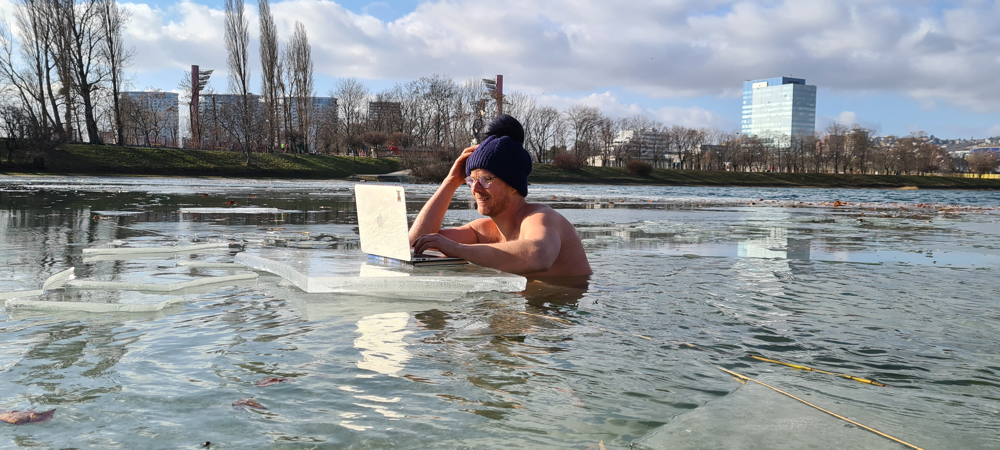

#+TITLE: Healthy Programmer

This project is actively growing—new exercises and routines are added every week to help you stay healthy and pain-free at your desk.
I'm also working to make it easier to find the right exercise for you: soon, all exercises will be categorized by body area (neck, back, hips, knees, ankles) and by difficulty.

#+BEGIN_TODO
- Categorize exercises by body area (neck, back, hips, knees, ankles)
- Categorize exercises by difficulty
#+END_TODO

* Move Reminder: Stay Healthy Behind the Computer!

Are you spending all day behind a computer? I do too—44 years old, a lifetime at the keyboard.  
But for the last 6 years, I have been standing only (no sitting at all), working 8 hours a day, and regularly exercising and stretching during work.  
This is how I became fit again—no more pain, just energy and flexibility.

**The Move Reminder script is the centerpiece of this project.**  
It pops up a random exercise GIF at regular intervals, reminding you to move, stretch, and break the sedentary cycle—even while standing.

---

**How to Install & Run**

1. Make sure you have Python 3 installed.
2. Run the script from the terminal:

#+BEGIN_SRC shell
./script/run_move_reminder.sh --interval 60 --duration 30 --position bottom-right
#+END_SRC

Or, for a quick test:

#+BEGIN_SRC shell
./script/run_move_reminder.sh --interval 1 --duration 15
#+END_SRC

This will show you all available options.

---

**Script Parameters**

- `--interval INTERVAL`  
  Interval in minutes between reminders (default: 30 minutes)

- `--duration DURATION`  
  How long (seconds) to show the GIF window (default: 30 seconds)

- `--position {top-left,top-right,bottom-left,bottom-right,center}`  
  Popup window position (default: bottom-right)

- `-h`, `--help`  
  Show help message and exit

**Example:**
#+BEGIN_SRC shell
./script/run_move_reminder.sh --interval 45 --duration 20 --position center
#+END_SRC

---

* My Story: Standing, Moving, and Feeling Great

I spent my whole life behind a computer. For the last 6 years, I have not sat at all during work—standing only, 8 hours a day.  
But standing still is not enough! The real change came when I started moving, stretching, and exercising regularly throughout the workday.

Now, at 44, I have no more pain. My body feels strong, flexible, and alive.  
The Move Reminder script helps me keep this habit—reminding me to move, stretch, and stay active, even during long work sessions.

* Why Movement Matters

Sitting is not a natural human posture, but standing still all day isn't perfect either.  
Our bodies need regular movement—muscles weaken, joints stiffen, and pain becomes normal without it.  
With a few minutes of movement every hour, you can stay pain-free and energized.

**The Move Reminder script** makes it easy: it interrupts your work with a random exercise GIF, so you never forget to move.

---

* Essential Exercise Routines

**See [[./exercise/exercise.org][exercise/exercise.org]] for full details and images.**

**During the Workday:**
- Shoulder mobility with resistance band
- Hamstring stretch & lower/middle back strengthening
- Shoulder/chest stretch & glute activation
- Hip flexor & abs stretch
- Back, shoulder, and glute strength (wall exercises)
- Handstand (advanced, optional)

**Key Principles:**
- Stretch what is tight, strengthen what is weak
- Focus on back, hips, shoulders, and legs—counteract static posture
- Make it fun! Use a balance board, try new moves, and laugh at yourself

**Results after 2 years:**  
No more lower back pain, flexible body, and a habit that sticks.  
Sometimes I do these exercises during the day, not just in the morning.

---

* Standing as a Way of Life

**See [[./exercise/standing.org][exercise/standing.org]] for full story and tips.**

After years of sitting, I switched to a standing desk—and for the last 6 years, I haven't looked back.  
Standing all day, combined with regular movement and stretching, keeps my body active and pain-free.

**Benefits:**
- Natural shoulder and elbow position
- More energy, less sleepiness
- Higher calorie burn
- Better mood and focus

**Tips:**
- Knees slightly bent, toes forward, pelvis neutral
- Use an absorption mat for comfort
- Move and stretch throughout the day

---

* More Healthy Programmer Tips

- [[file:./keyboard/keyboard.org][Ergonomic keyboard construction]]
- [[file:./keyboard/traditional-vs-ergo.org][Natural standing position]]
- [[file:./hardening/hardening.org][Cold water hardening]]
- [[file:./patterns/4k-code-visualization.org][4K monitor for code visualization]]
- [[file:./workspace/workspace.org][Multi-workspace window manager setup]]
- [[file:./patterns/keep.org][Keep learning and playing!]]

---

#+CAPTION: My workspace and daily movement inspiration

Stay healthy, keep moving, and enjoy your work!

Michal Kelemen
