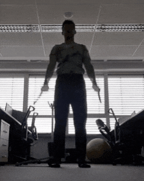
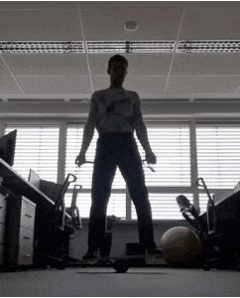
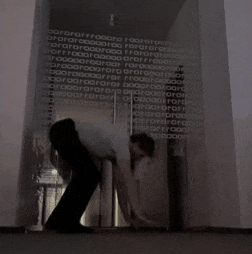
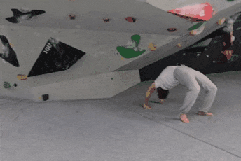
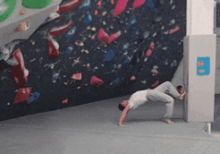

* Motivation

The body position while sitting in a chair is far from a neutral human posture. Naturally, our muscles, tendons, and joints are not developed to remain still for long periods.
However, the human body is a very adaptive ecosystem and, when forced, it slowly assimilates to environmental conditions. Sitting upright for hours can be very challenging for the neck, upper, and lower back.
It requires strong back muscles. But the back is not the only body part affected. The knees are constantly bent in the sitting position and often positioned at a strained angle. The thighs, calves, and ankles
are unused and progressively become tight and weak.
The shoulders, forearms, and wrists are rotated for hours from their comfortable state to allow for typing on the keyboard and moving the mouse.
Over the years, some muscles and tendons slowly become elongated while others shorten, which may result in muscle/tendon imbalances in the limbs, back, and core.
Without movement, muscles lose their original and natural flexibility. As a result, the joints, bones, and spinal vertebrae become responsible for body support instead of muscles and tendons.
All these factors combined may result in chronic pain and damage to the musculoskeletal system.
To avoid unfavorable body changes caused by incorrect sitting without frequent breaks, compensatory power exercises and stretching are highly recommended.

TODO: hamstring exercise, shoulder bridges with different foot placements
      lower back strength ... on the table leg raises

* Morning exercise routine

This routine has been developed over 2 years of practice.

** Shoulder mobility with resistance band

This is the first exercise of the day. After a night's sleep, shoulders and back are often stiff. This is how to restore mobility.
To build a habit, exercise must always be fun. Sometimes I use a balance board for this and other exercises.
This stretch is very important for some of the following workouts.
We will do some strengthening exercises as well. The best practice is to strengthen only previously stretched muscles
to ensure they are strengthened through their full range of motion. This way, the muscle will grow long and remain flexible.

Result:

- Arm behind the shoulder. This is an excellent exercise as it un-bends the upper back. It is the opposite movement/position to
  the poor posture of sitting when the upper back is bent forward.

   

** Hamstring stretch, lower and middle back strengthening

In this exercise, the back is actively bent in an arc (the opposite position to incorrect sitting).
While bending forward at your hips (not your lower back), try to keep this
arc position as much as possible. Feet are kept together or slightly apart in parallel.
You should feel your hamstrings (the back side of your legs) stretching,
and at the same time, you should feel tension in your lower and middle back as you actively maintain the arc position.

It's okay if you cannot reach the floor with your hands. With time and repetition, you will get there. Be patient.
Hamstrings get shortened during long periods of sitting as we keep our knees bent all day long on the chair.

[[./images/20220105_092052.gif]]

** Shoulder and chest muscle stretch, gluteus maximus (butt, sitting muscle) strengthening

This exercise addresses shoulder mobility in backward motion and also stretches chest muscles that are often shortened due to
sitting with the upper back and shoulders bent forward.
As you push your hips up, actively press your gluteal muscles together to strengthen the gluteus maximus.
This muscle often gets weak during long periods of sitting.

Tips:

- Keep your feet aligned, pointing forward in parallel, not sideways.

[[./images/20220105_092528.gif]]

** Quadriceps, Hip flexor, Abs stretch

This is a perfect exercise for stretching the back leg quadriceps and hip flexor. It also stretches the abdominal muscles.
At the same time, this movement strengthens the upper back and shoulders. As you can see and feel, this exercise activates
muscle groups that are negatively affected by sitting.

Tips:

- Repeat the exercise with the other leg as well.
- Keep your legs and hips aligned; both feet should point forward, not to the side.
- Alignment to the neutral position is essential and very important for any kind of stretching in general.
- If you try to straighten the back leg's knee, the hip flexor stretch will become even more effective—you will feel it.

Result:

- Stretched and lengthened: quadriceps, hip flexors, abdominal muscles
- Strengthened upper and middle back and shoulders

[[./images/20220105_073816.gif]]

** Shoulder, middle and upper back flexibility / quadriceps and glute strength

This is another exercise for strengthening your back, stretching your abdominal muscles, and exercising arms behind the shoulders.
During the first exercise, keep your arms straight and try to reach the wall with your chest. This will form your back into a nice arc.
As you progress, you can place your hands lower and lower or step further and further backward.

The second exercise is preparation for a bridge/wheel. Here, it is very important to keep your feet pointing forward in parallel, not sideways.
Actively squeeze your gluteal muscles together and try to reach as low as possible. Then use your hands to walk up the wall back to
the initial position. This exercise strengthens quadriceps, glutes, your back, and shoulders while stretching your abdominal
muscles.

[[./images/20220105_105614.gif]]  [[./images/20220105_134537.gif]]  [[./images/20220105_105225.gif]]

** Handstand, shoulder flexibility, back mobility and strength

Another way to train your back and shoulder mobility is the handstand exercise, because you can use your own weight to put more pressure
on your "arms behind shoulders" stretch. Be very careful with this exercise. Actively maintain the back arc by using your upper and middle back
muscles while you feel a stretch in your shoulders, abdominal muscles, and also quadriceps.

In addition, you can rotate from side to side at your waist. You will experience extra stretch in your shoulders, abdominal, and oblique muscles.

[[./images/20220105_134243.gif]]

** Advanced results after 2 years of practice

As I mentioned, if you want to build a habit, it must be fun, and there are some funny movements.
After 2 years of practice, I was able to do this wall-assisted wheel. This advanced exercise requires all
the muscle groups affected by sitting (shoulders, upper, middle, lower back, hip flexors, quadriceps, hamstrings, calves) to be both stretched and strengthened.
For me, reaching this goal is a victory in the fight against chairs and a sedentary lifestyle.

  [[./images/20220105_134953.gif]]

* Conclusion

I believe these are the essential compensatory exercises for an inactive lifestyle spent sitting in an office chair.
No more lower back pain, goodbye stiff body.
I never force myself to do the full routine every day, but the first 5 basic exercises are a must. After 2 years of practice, they
have become a habit, and my body requires them every morning automatically. Sometimes I do some of them during the day as well if I feel like
a quick stretch.

I tried more workouts that I do not describe here because I didn't stick with them for a longer time.

A strong and flexible body allows me to do some unique, eye-catching, funny movements that make me and others laugh.
Good mood is also an important part of human 'feel good' nature and keeps me going. But with all respect
to my health and age (now 45). This is the result of continuous, incremental daily improvements.

  
