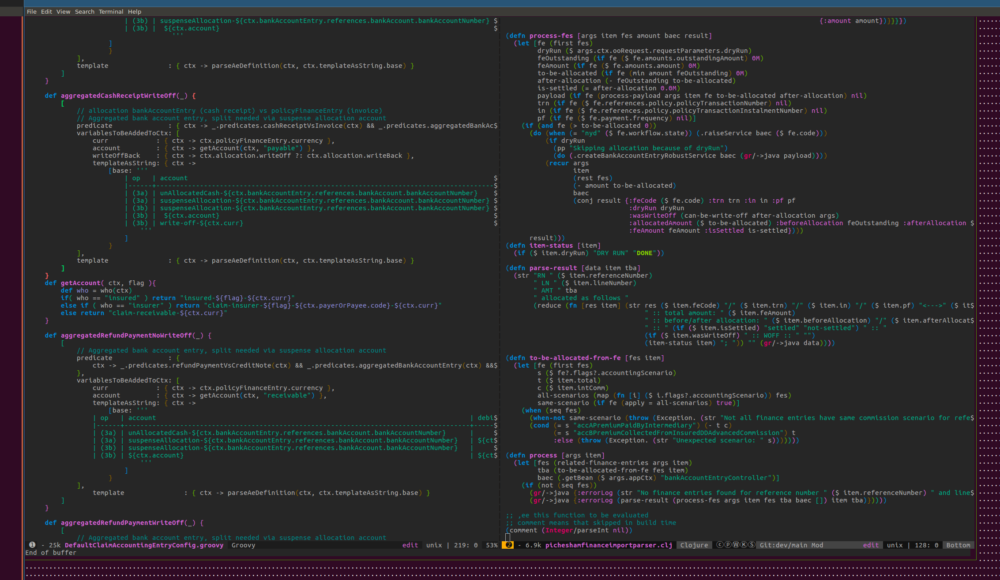

* Pair programming

We found pair programming very effective for tasks where focus and concentration are key.
Especially when complicated and error-sensitive refactoring of code was inevitable. Programming is sometimes
a very stressful activity. Having a colleague and friend on the line is a very helpful element. Even simple supervision
and gentle, supportive talk help a lot. Pair programmers don't need to be at the same business or technical level at all.
During pair cooperation, you may find the editing skills and habits of your counterpart very interesting.

For example, we worked on some refactoring tasks in the accounting module. The DSL definition of accounting templates needed to be
amended in several places across multiple files. I had business knowledge while my counterpart knew exactly
how to use Vim macros to change the configuration effectively.

Pair programming sessions can be used for educational purposes as well.
Personally, I learned how to code in the Clojure Lisp language through pair programming sessions.
It is very effective when two brains are sharing and supplementing thoughts about the common code base.

Technical point of view:

One of us established a shared SSH session via tmate (https://tmate.io/) and the other connected to it.
We were very lucky that our favorite IDE, Emacs (Spacemacs), can be executed in command line mode.
Both of us were able to use the same IDE and edit the same files. We alternated between typing and supervising
as needed.

We also had verbal contact via Jitsi (https://jitsi.org/), so our communication and cooperation became
super effective. When we tried this for the first time, it was a real programming adventure.

