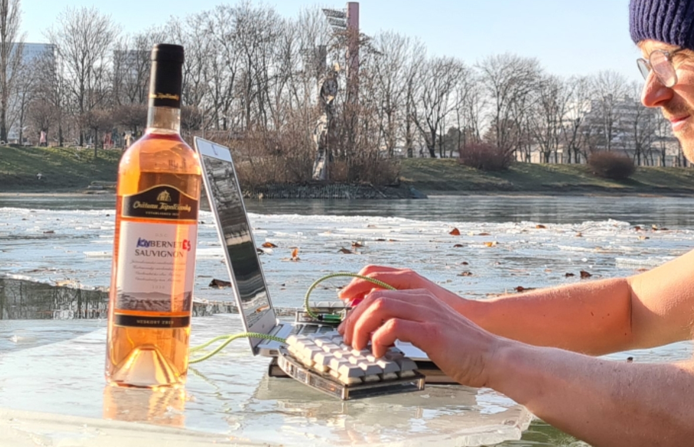

* Hardening in the cold water

During the winter, our team established hardening sessions during lunch several times per week.
Cold water is very refreshing. It ends any frustration from previous coding within a minute.
After 5 minutes in the freezing water, we return to the office charged with a new boost of energy, feeling good and fresh
for the rest of the day.

[[./20220118_114153.jpg]]

I have always wanted to have a crystal-clear desk and work in a transparent, well-organized environment. :)

How we started:

- It's not recommended to start in the winter time straight
- So we started in August when water temperature was over 20
- We kept going to the water 2 or 3 times per week and we didn't stop
- Temperature in the big lake never drops down quickly even if the air temperature drops 10 degrees down suddenly
  In the lake where we use to go it never dropped more than 1 or 2 degrees per week
- Considering frequency of 3 times per week, we trained every 0.5 degree drop

How it works:

- It is important to calm down before immerse
- The first minute is the most difficult as the body is fighting in stress mode. This is also the time when
  we naturally switch into survival mode, and that's why all the frustration goes away suddenly. We need to survive.
- Then we calm down and naturally start to breathe slowly and deeply.
- Sometimes we swim for a while
- The most fragile parts of the body are fingers and toes. The body shortens blood circuits and
  concentrates on the core to keep the temperature of internal organs high. This requires limiting blood circulation in the limbs.
  To keep them warm, I personally try to do tiny movements with my toes and fingers.
- If the water is too cold and your fingers hurt, just take them out of the water.
  You can play with this by submerging them for several seconds and switching as you feel.
- It is good to use a cap; there is no fat on your scalp, so keep it warm.

How long:

- The common rule is to stay in for as many minutes as the water temperature in degrees Celsius.
- Intermediate hardeners: +2 or 3 minutes.
- Personally, if the temperature is over 10°C, we stay 10, 12, or even 15 minutes sometimes.
- Under 10°C, we keep the rule. In 7°C water, we stay from 7 to 10 minutes.
- Under 5°C: we stay 3, 4, or 5 minutes.
- If I feel good, sometimes I stay 5 minutes in 2.5°C water.
- I never force it. Minutes are not important. After surviving 2 or 3 minutes, there are no extra health benefits to staying longer.

Frequency:

- once per week is enough to get health benefits
- we never go more than 3 times per week

After the bath:

- It is important to exercise. It is well known to do simple warming exercises for the same number of minutes as you spent in the water.
- Exercise restarts blood circulation into limbs, fingers, and toes.
- It warms up the entire body.
- After the cold bath, muscles are stiff and joints are fragile. So it is better to avoid running.
- It is good to drink hot tea to warm yourself as well.
- Shivering is normal; the body tries to shake muscles to warm itself. The better the exercise, the less shivering.

Previously mentioned is trainable:

- With time, the first minute will not be as shocking as in the beginning.
- Your fingers and toes become more resistant and will not hurt as before.
- Reduced or no shivering later on.

My second vs first season

- almost no shivering
- no need of tea but if I have a chance a have one with me
- no towel, I get dry naturally and dress up when I am dry
- hands under water for 5 minutes is no problem any more

Benefits:

- Inflammation protection/reduction. If you have some small inflammation in your body, it will be eliminated,
  and some people claim that you get 6 days of protection or risk reduction of inflammation processes in the body.
  That's why you feel your energy and health are boosted after the hardening procedure.
- Increase in brown fat, which the body burns every time you are exposed to low temperatures.
  As a consequence, you will never need to dress as much anymore; you will become more resistant to cold weather.
- Immune system improvements.
- Good mood, no frustration, calm nature.
- Instant presence—just being, no thinking (Wim Hof's words).

What we never do:

- we never put our heads under the water
- we never submerge under the ice

Personally, I am doing this for the second winter season (2022) and I never get sick.
If we do not step into cold water, we walk in shorts and T-shirts even in freezing temperatures to the nearby canteen to get lunch,
and we use this air hardening as an alternative.

Some of us are also fans of the Wim Hof breathing method, which is in fact meditation with all its health-improving benefits.
This 11-minute-long guided breathing session is good to do before stepping into the water.

https://www.youtube.com/watch?v=tybOi4hjZFQ&t=1s

Kubernetes developers need to calm down.

