* My motivation for ergonomic keyboard

The keyboard I selected and the supporting wrist holders satisfy these physiological principles:

- Neutral positioning of the back is straight (not bent in the upper or lower part)
- Neutral position of the shoulders is pulled back (not leaning forward)
- Neutral position of the wrists when sitting with elbows bent is with the thumb pointing up, not to the inner side

Based on these, I understood that I need:

- A split keyboard that allows me to type without shoulders internally rotated (which leads to unwanted shoulder forward bending)
- 40-degree rotated wrist holders that eliminate wrist rotation

Investigation of correct and incorrect sitting: [[file:./traditional-vs-ergo.org][Natural body position while sitting]]

The keyboard I chose is: Keebio Iris
https://keeb.io/products/iris-keyboard-split-ergonomic-keyboard

And my custom layout can be found here:

https://github.com/healthy-programmer/qmk_firmware/tree/michalkelemen/keyboards/keebio/iris/keymaps/michalkelemen

* Construction

For holder assembly, these materials are needed:

- 4 pieces of wooden plates (I used kitchen cutting boards from a local manufacturer here in Slovakia for 5 EUR/piece), size: 150 x 250 x 10 millimeters, which perfectly fit the Iris keyboard
- 4 metal bars with threads (for screws). I used 80-millimeter-long bars.
- 4 screws fitting the metal bar threads
- 4 self-tapping screws
- 2 pieces of wooden pin (to prevent the keyboard from slipping off the sloping bottom part of the holder)

and these tools were used:

- saw
- drill
- screwdriver
- glue (fast-drying superglue)

* Assembly procedure

** Bottom part

1) Two wooden plates are used for the bottom part. All I did with them was drill 2 holes 15 millimeters from the inner border.
2) Then I mounted 2 bars to each bottom piece using screws.

** Wrist supporting pads

1) Each wrist pad consists of 2 pieces.
2) The upper piece was created by sawing the wooden plate at an angle, copying the shape of the keyboard.
3) The lower piece is just the leftover from step 2.
4) I used glue to put these pieces together.

** Putting them together

1) Finally, I screwed the bottom part and wrist supporting part together with small self-tapping screws from the bottom side. Be careful and use thin self-tapping screws. Screw them in slowly to avoid wood cracks.
2) The last thing I needed to do was glue the wooden pins to the outside edge of the holder. This prevents the keyboard from slipping.

*Note*: The reason why I glued the top and middle part (instead of screwing all 3 pieces together) is that shorter and thinner self-tapping screws are sufficient. And the reason why I didn't glue all
3 pieces together is that the wrist pad can still be unmounted in the future, and the leg screw on the bottom part is accessible for leg replacement, for example, if you decide to change the sloping angle.

* Procedure pictures

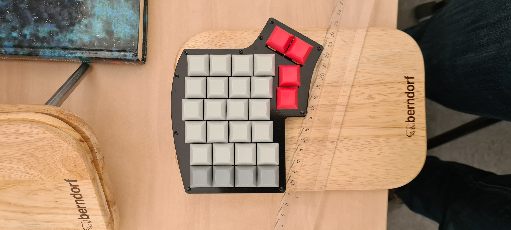
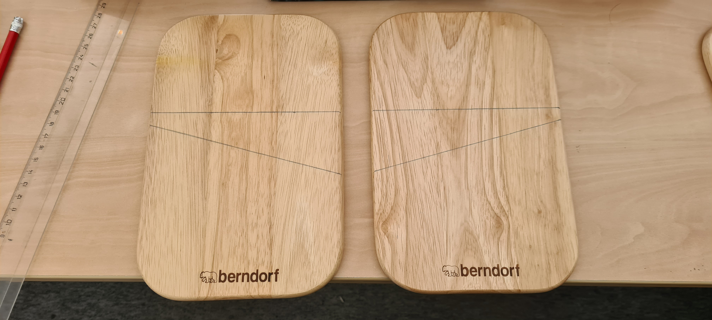
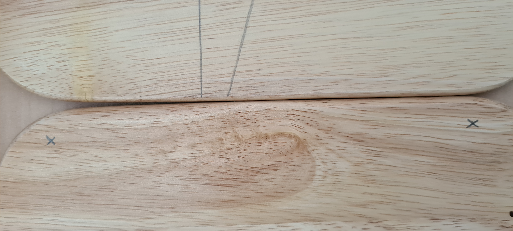
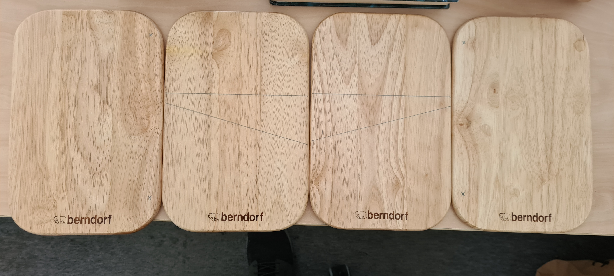

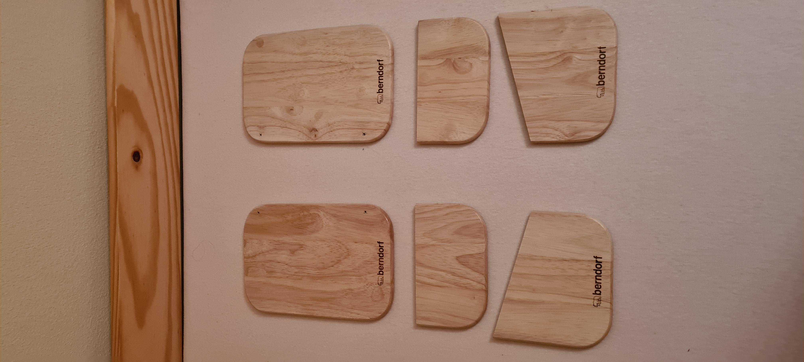
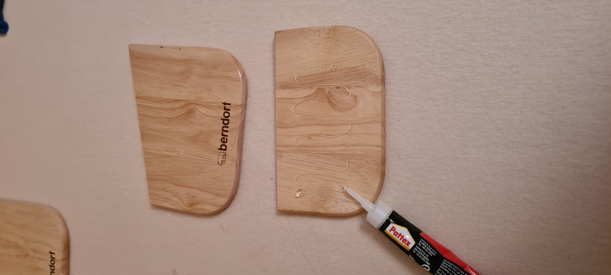
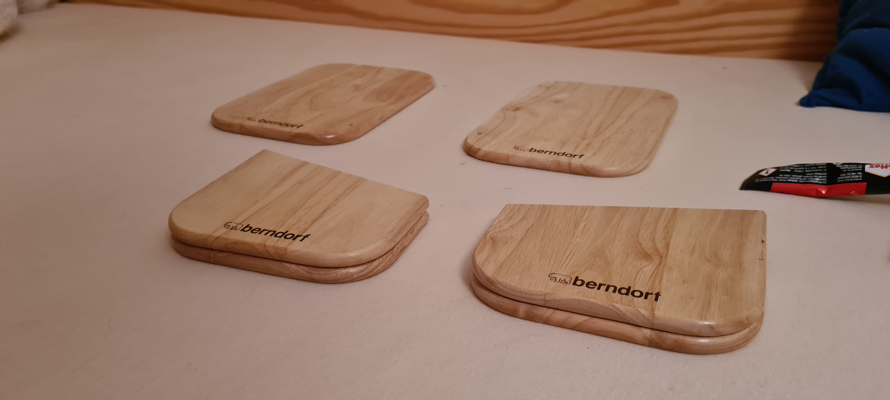
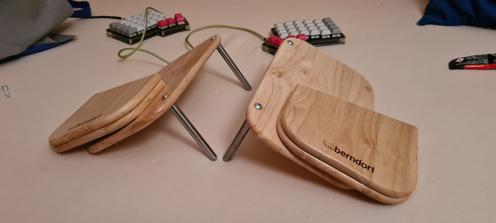
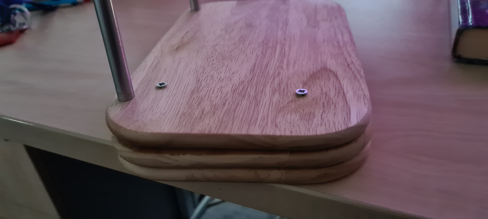
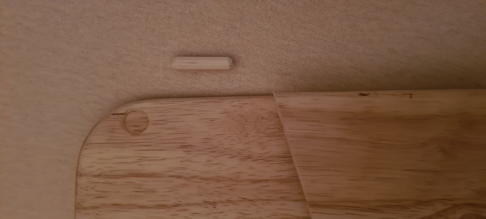
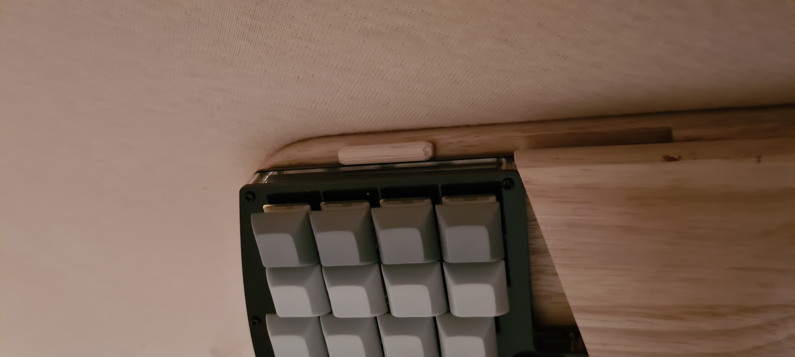
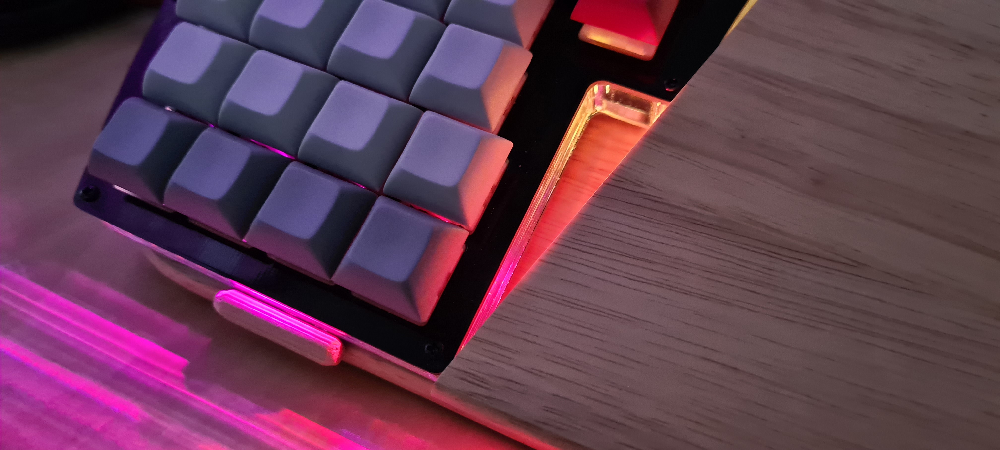
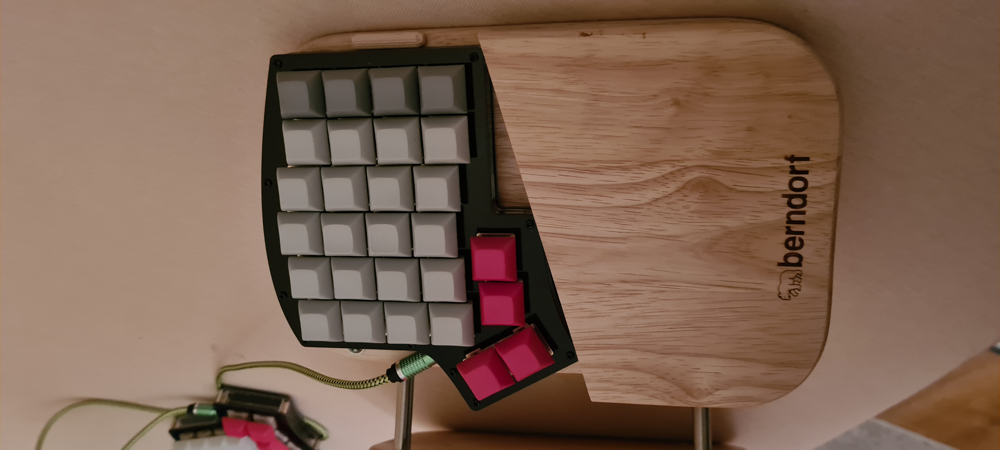
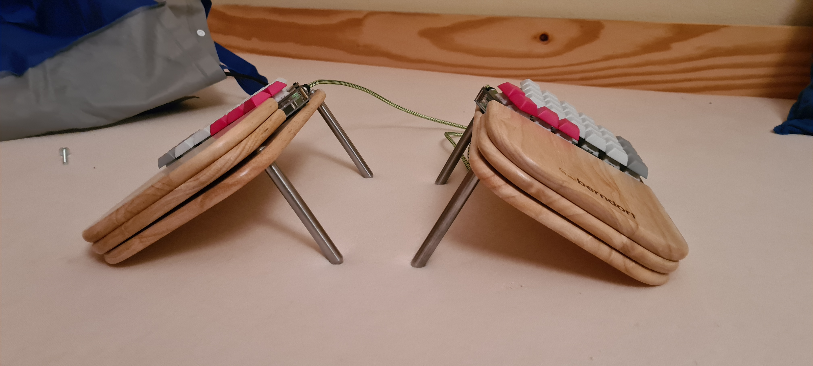

* Result pictures

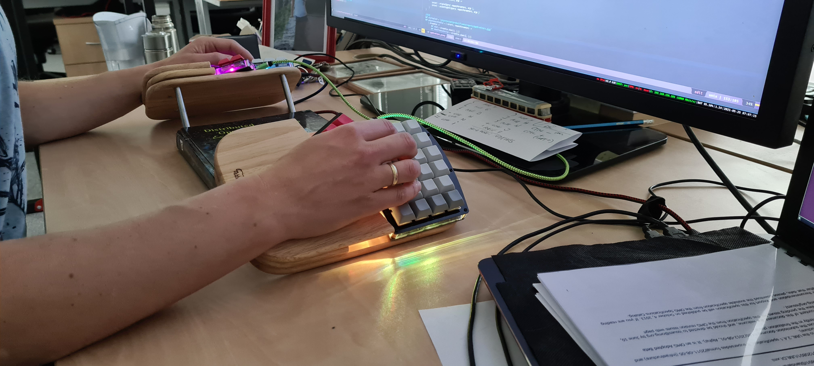
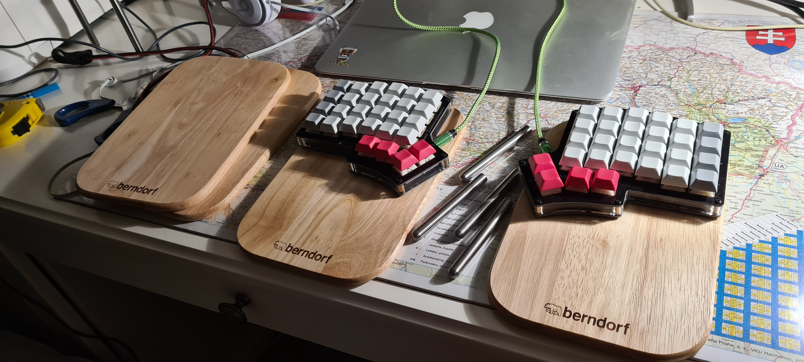
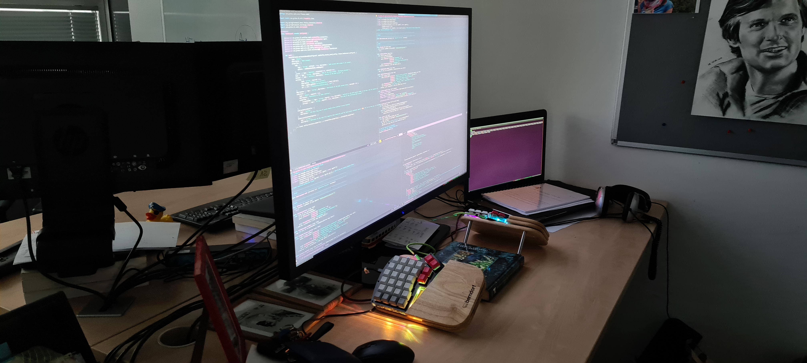
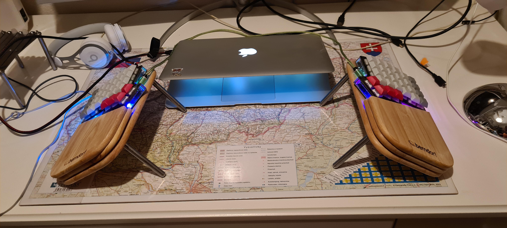
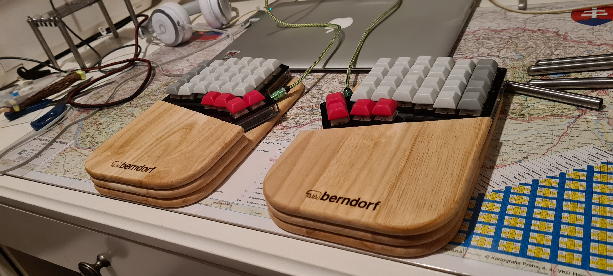
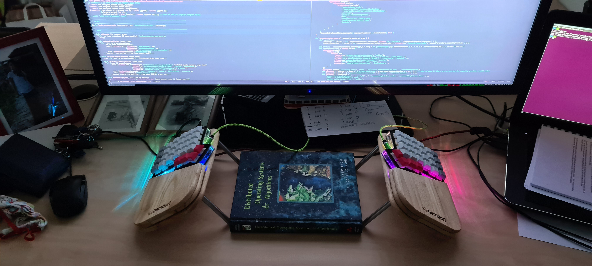
