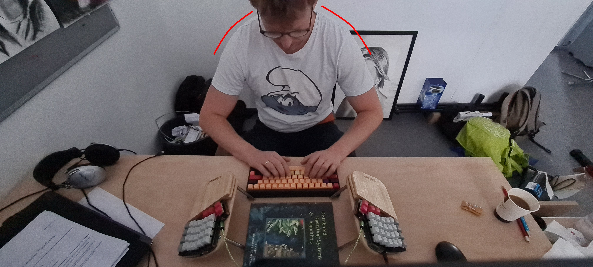
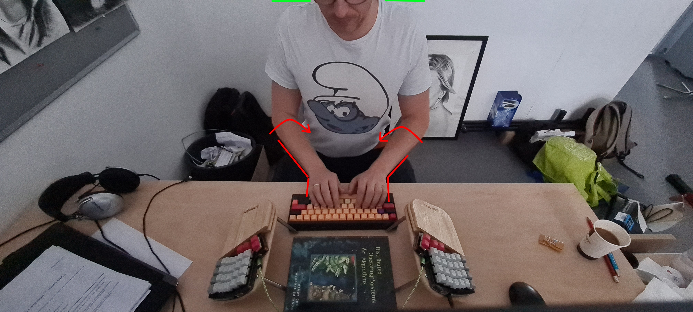
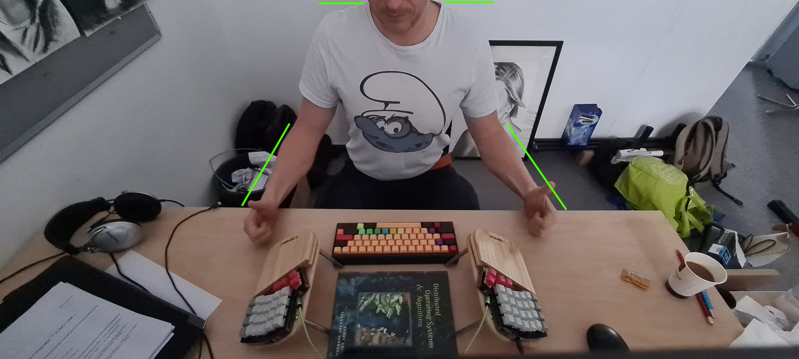
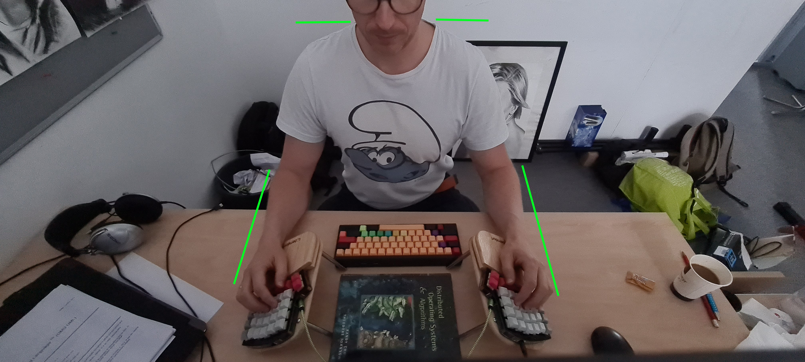
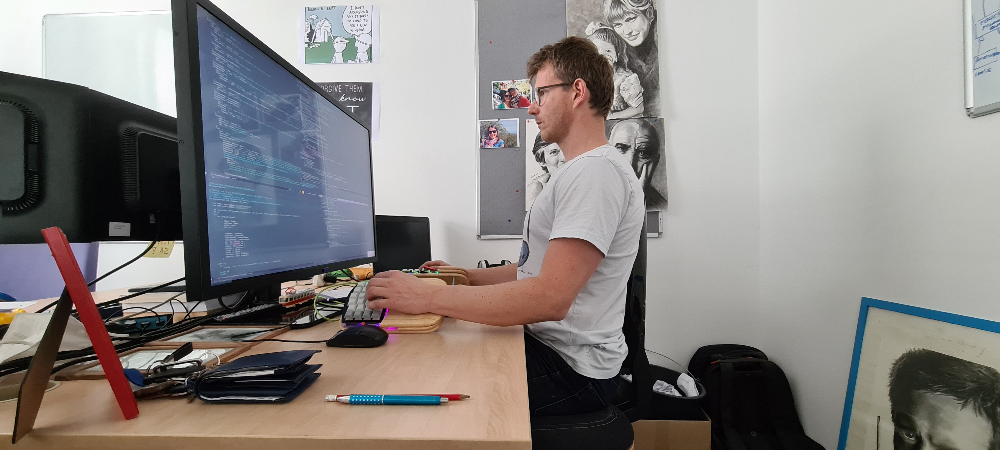

* Natural body position while sitting

This is how I used to sit behind a normal keyboard. My shoulders leaned forward as I tried to ensure a comfortable position for my wrists.

When I tried to sit straight, my wrists felt uncomfortable because of the unnatural bend and internal rotation of the forearm.

I tried to investigate what the natural position of the wrists is while sitting straight. And I found nothing new: thumbs are pointing up, forearms are not internally rotated, and hands are naturally
positioned apart at shoulder width. In this position, shoulders do not fall into internal rotation and back humping.

That's why I chose a split keyboard. To eliminate internal forearm rotation, I built wrist-supporting holders that guide my forearms to their neutral position.

This is how I cheaply built wrist-supporting holders from wooden plates originally used as cutting boards in my wife's kitchen. [[file:./keyboard.org][Link]]

*Note*: I received very useful feedback from my friend that in the previous picture, my forearms are touching the edge of the table and my ulnar nerve is stimulated.
In the long term, this could result in cubital tunnel syndrome. This can be avoided, for example, by raising the chair level. Now my arms are naturally hanging.
Alternatively, they can be just slightly touching the table surface.

