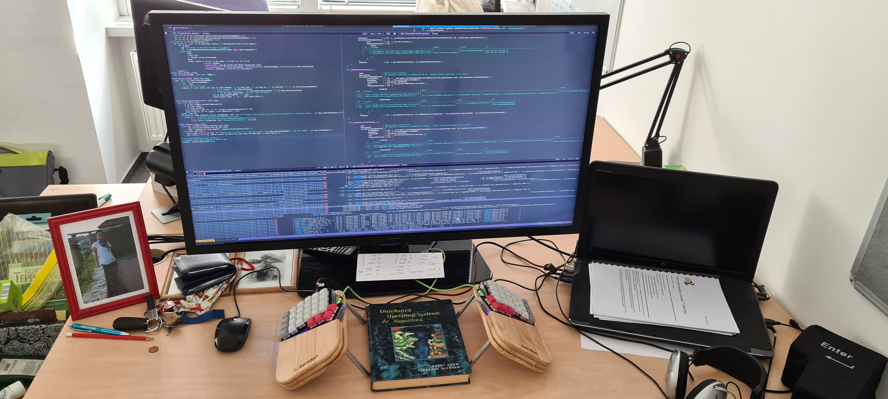

* Code visualization on 4k monitor

I found a 4K monitor to be a very effective tool for code visualization, especially in situations when related files (same feature, same module) need to be edited.
It is also very elegant for test-driven development. Tests and business code can be developed at the same time on the same screen.

