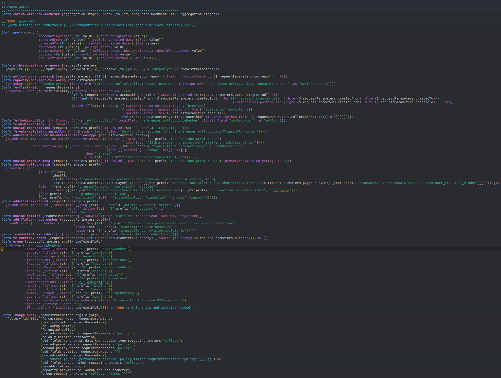
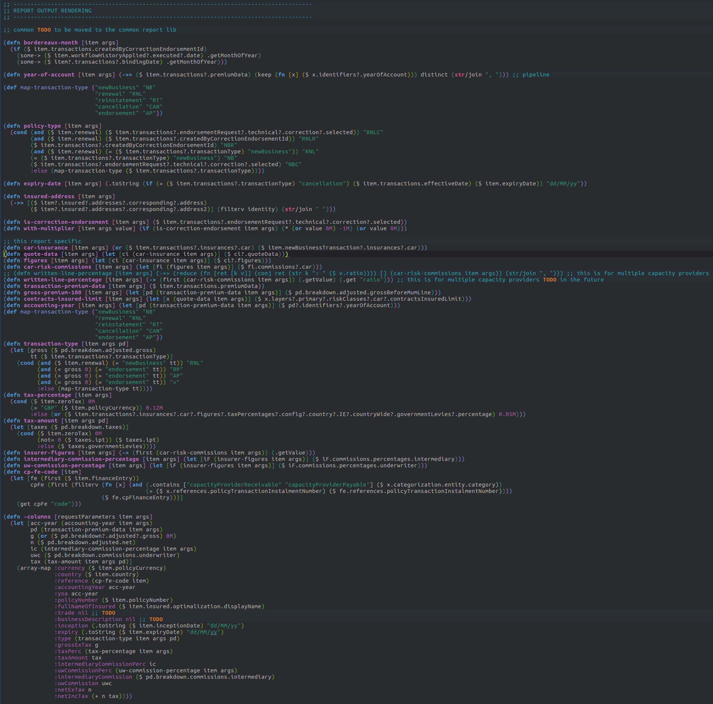

* Keep playing/learning - effective dealing with frustration

Tasks on projects are not always fun to do. Sometimes they cause a lot of frustration, and not just from a time schedule perspective.
There are types of tasks that are time-consuming and technologically boring. But at the same time, they are very important for the project and maybe
the most important for the project. For me, implementation of custom reports are these types of tasks—reports and letter templates.
They don't bring any new technical knowledge and don't bring any emotional satisfaction. The human brain is naturally starving for new knowledge.
But writing reports doesn't bring anything new. Once the initial database query is optimized, which is the most interesting part of the task,
the rest of the work is about binding query results into final Excel columns, playing with formatting and layouts, and sometimes extra calculation of
fields that are not directly part of the query result. At the same time, reports, letters, and other system outcomes are the most important
functionality as these are published out of the system to the customers (letters) and third parties (reports) and therefore should be implemented properly.

** Play

When I am on this type of task, I cannot concentrate for a long time and I tend to lose my focus quite often. In these situations, I found it very
effective to have useful alternatives ready for quick relaxation and recovery. Instead of browsing social networks—which is very time-consuming
and a passive way to relax, not related to my programming profession at all—I found a very effective alternative that comes from my hobby and field of interest
and is still related to my job. It can vary from person to person. For me, it is fast typing practice. Personally, I have a dedicated
workspace for relaxing with these two pages ready to serve.

https://monkeytype.com/

https://www.keybr.com/

https://play.typeracer.com/

The point is, when I have already lost focus, I am still doing something active and helpful. Typing faster and more precisely is a benefit for
the future, and this skill is definitely worth gradually improving. And as this is an active form of relaxation, a few minutes is enough to recharge
the batteries.

** Learn

Recently, I inherited tasks to contribute to already existing reports implemented by former colleagues.
The task was to optimize the query and then extend the Excel output with new columns.
After a short period of time, I found out that optimization meant rewriting the original database query completely because it was wrongly implemented.
I also needed to adjust the data model first, then implement the data intervention scripts and execute them on production data
in order to be able to simplify the query for faster execution.
Some reports I needed to rewrite completely, including the column binding. What is more frustrating than implementing
boring tasks and, in addition, not from scratch but having to study someone else's code and optimize it?

During a pair programming session, we decided to rewrite some parts of the implementation into a new language (Clojure). The original implementation
was in Java/Groovy. Clojure is a language for Lisp code that runs in the JVM. All Java libraries can be used in it, and at the same time,
we can still use a functional rather than object-oriented paradigm. Depression changed into challenging euphoria immediately. I would learn
something new (a new language), but what's more important, we soon found that report implementation in Clojure is much more effective and
less time-consuming because Clojure enables us to reload scripts or functions with their new version in the JVM instantly, without the need for a server restart.
Once the interface is set between the Java core application and the Clojure extension code, the server doesn't need to be restarted at all. And we can
focus on query implementation and column binding in the new language.

The conclusion here is that sometimes it is possible to benefit from despair by changing the approach.

Mongo Query implementation in Clojure

Report Column binding implementation in Clojure

